Chapter 2 – Linux Security Basics
Overview

In this lab, I worked inside my Ubuntu Virtual Machine and performed system updates, user management, group management, file permission changes, and Access Control List (ACL) configuration. All tasks were completed using the terminal. This lab helped me understand how Linux controls system access and security.

1. Retrieve Available Updates
Command
sudo apt update

Explanation

TWhat Happened (Based on My Output)

When I ran this command, the system connected to Ubuntu repositories like archive.ubuntu.com and security.ubuntu.com. It downloaded package lists and then showed that several packages could be upgraded.

This command did not install updates. It only refreshed the system’s package database so Ubuntu knows which updates are available.

This is important because outdated packages may contain security vulnerabilities..

2. Upgrade the System
Command
sudo apt upgrade
Explanation
The system showed that 334 packages were going to be upgraded. It downloaded and installed the updates. During the process, I noticed it generated a new kernel image:

Screenshot

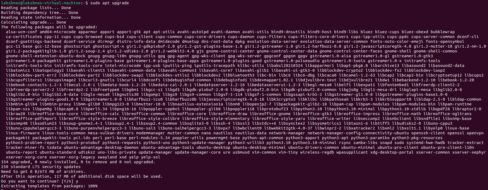
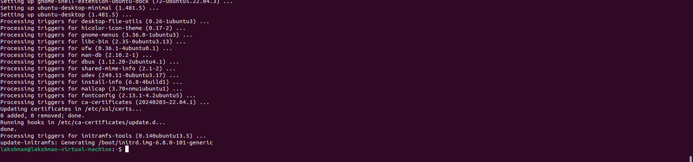

This means the Linux kernel itself was updated.

Upgrading is important because it installs security patches and fixes bugs. If the kernel is updated, a reboot is required.

3. Reboot the System
Command
sudo reboot

After reboot:

uname -r
Explanation

After upgrading, a reboot was required because the Linux kernel was updated. The uname -r command confirms the currently running kernel version. Rebooting ensures that the new kernel is loaded into memory.

Screenshot

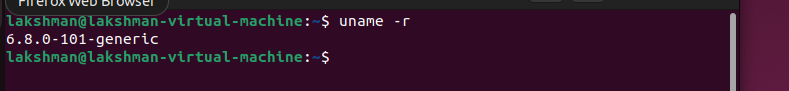

4. Switch to Root User
Command
sudo su root
Explanation

The $ changed to #, which shows that I now had root privileges. Root has full control over the system

Screenshot

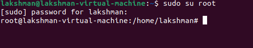

5. Create Users Using useradd and adduser
Commands
useradd bobby
adduser sally

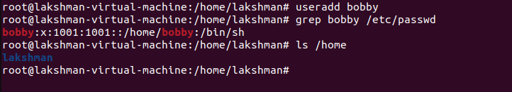

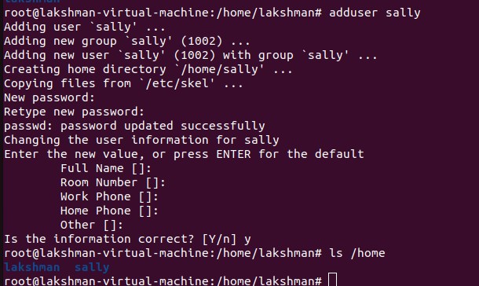

Explanation

When I used useradd bobby, it created the user entry in /etc/passwd, but it did NOT create a home directory. When I checked /home, I only saw:

lakshman

After using adduser sally, the system:

Created a home directory /home/sally

Asked for a password

Copied default files

Created a group named sally

When I checked /home, I saw:

lakshman  sally

This showed that adduser is more complete and interactive compared to useradd.

6. Switch to Sally
Command
su - sally

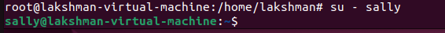

Explanation

The prompt changed to:

sally@lakshman-virtual-machine:~$

This showed that I was now logged in as Sally and had normal user permissions.

7. Attempt to Create a User as Sally
Command
useradd earl

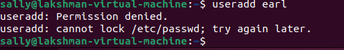

Result

Permission denied.

Explanation

The system returned:

Permission denied.
cannot lock /etc/passwd

This happened because Sally is not an administrator. Creating users requires modifying /etc/passwd, which only root can access.

This demonstrates the principle of least privilege.

8. Delete User Bobby
Command
sudo userdel bobby

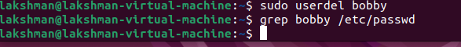

Explanation

This removed the bobby user from the system account database.

9. Change Sally’s Password
Command
sudo passwd sally

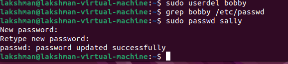

Explanation

The system showed:

passwd: password updated successfully

This updated Sally’s password in /etc/shadow.

10. Why It Is Bad Practice to Stay Logged in as Root

It is not safe to stay logged in as root because root can change or delete any system file. If a mistake is made, it can damage the operating system. Also, if malware runs while logged in as root, it gets full control of the system. It is safer to use a normal account and only use sudo when needed.

11. View User ID
Command
id

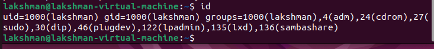

Explanation

The output showed:

uid=1000(lakshman)
gid=1000(lakshman)
groups=1000(lakshman),27(sudo),...

This means my user ID is 1000 and I belong to multiple groups including the sudo group.

12–16. Group Management
View Groups
groups lakshman
id sally
Create New Group
sudo groupadd cybersec
Add Sally to Group
sudo usermod -aG cybersec sally

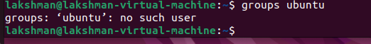

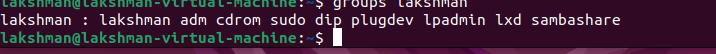

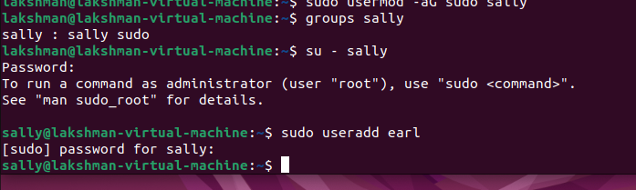

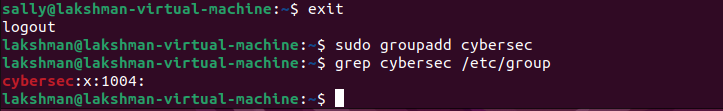

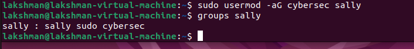

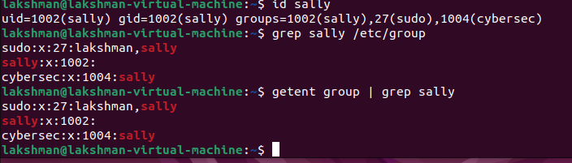

Explanation

Groups allow role-based access control. Adding a user to a group grants access permissions assigned to that group. The -aG option appends the group without removing existing memberships.

17. Directory Permissions
Command
mkdir lab1
ls -ld lab1

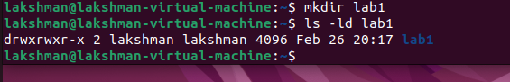

Output Example
drwxrwxr-x
Explanation

Permissions are divided into:

Owner

Group

Others

rwx means read, write, execute.

For directories:

Read = list contents

Write = create/delete files

Execute = enter directory

18. Create Bash Script
Script Contents
#!/bin/bash
echo "Hello World!"
Commands
chmod +x helloWorld
./helloWorld

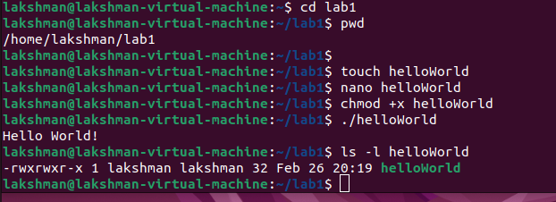

Explanation

The shebang (#!/bin/bash) tells the system which interpreter to use. chmod +x adds execute permission, allowing the file to run as a program.

19. File Permissions
Command
ls -l helloWorld
Example Output
-rwxrwxr-x

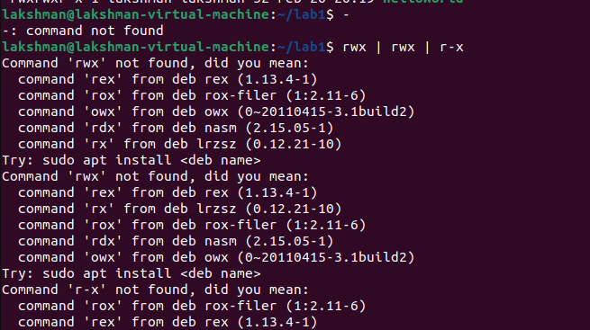

This shows:

Owner: full permissions

Group: full permissions

Others: read and execute

20. View Access Control List (ACL)
Command
getfacl helloWorld

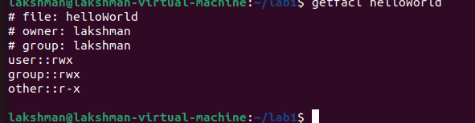

Explanation

This means the file was using standard permissions only.

21. Modify ACL
Command
setfacl -m u:sally:rw helloWorld

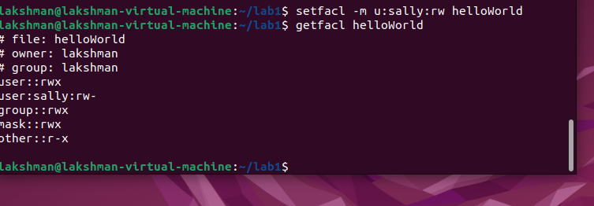

Explanation

This grants user sally read and write access to the file, even if she is not the owner. The mask field limits the maximum effective permissions for named users and groups.

